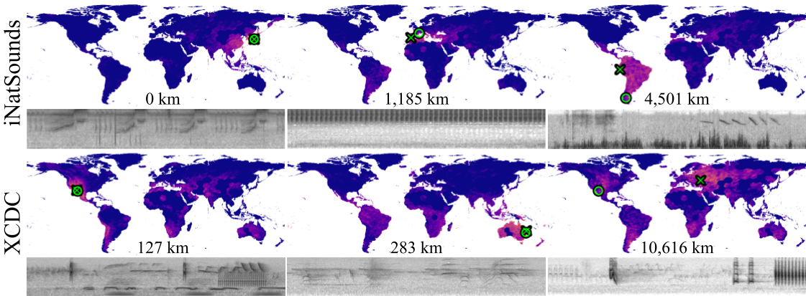

# Natural Sound Geolocation Benchmark 

This repo provides benchmark code for audio geolocation on iNatsounds and Xeno-Canto Dawn Chorus (XCDC) datasets, and also includes the official release of the XCDC dataset.

<p align="center">
  
  <br>
  <em>Figure 1: iNatSounds and XCDC predictions from around the world. </em>
</p>

## iNatSounds

Please see [visipedia/inat_sounds](https://github.com/visipedia/inat_sounds) for downloading instructions and documentation for iNatSounds. The dataset json files (for train, val and test) include latitude and longitude for each audio, which serve as labels for geolcoation. 


## The XCDC Dataset


We present the XenoCanto Dawn Chorus (XCDC) Dataset, a new benchmark for audio geolocation using wildlife sounds. Dawn chorus is a symphony of bird songs involving complex sounds. These communal vocal displays occur at dawn and are most noticeable during the breeding season. A rich diversity of species can be heard in a relatively short amount of time, possibly providing the cues needed to narrow down the location of a recording. We construct a new benchmark to test this hypothesis. 
From XenoCanto, we select audio that:
- was recorded during spring-time dawn chorus.
- is at least 3 minutes long.
- contains at least 10 distinct species.

This yields 576 recordings with corresponding geographic locations and species annotations.

We release all preprocessed audio `.wav` files and their annotations [here](https://zenodo.org/records/15420487). The annotation also contains urls to the original observation in XenoCanto, which can be used to access raw recordings. 

### Annotation Format
The [`xcdc_recordings.csv`](https://zenodo.org/records/15420487/preview/xcdc_recordings.csv) file contains metadata and labels for the dataset. Each row corresponds to one data sample. Below is a description of each column.
| Column Name       | Description                                                                |
| ----------------- | -------------------------------------------------------------------------- |
| `audio_id`        | Unique ID for each audio recording                                         |
| `url`             | Link to the original audio on Xeno-Canto                                   |
| `latitude`        | Latitude coordinate where the audio was recorded                           |
| `longitude`       | Longitude coordinate where the audio was recorded                          |
| `length`          | Duration of the recording (MM\:SS or HH\:MM\:SS)                           |
| `date`            | Recording date                                                             |
| `time`            | Recording time                                                             |
| `recordist`       | Name of the person who recorded the audio                                  |
| `main_scientific` | Scientific name of the primary specie present in the recording             |
| `main_common`     | Common name of the primary specie present in the recording                 |
| `all_scientific`  | List of scientific names of all annotated species in the recording         |
| `all_common`      | List of common names of all annotated species in the recording             |


**Note:** A Croissant metadata file [`croissant.json`](./xcdc/xcdc_croissant.json) is also provided. To integrate it into your machine learning workflow, please refer to [Hugging Face Croissant Guide](https://huggingface.co/docs/dataset-viewer/en/mlcroissant).

# Benchmarking Geolocation

To benchmark your method on these two datasets, please create a prediction csv file with the following two fields. See the ground-truth files for [XCDC](./ground_truths/xcdc_gold.csv) and [iNatSounds](./ground_truths/inat_test_gold.csv) for examples. 

| Column Name       | Description                                                                |
| ----------------- | -------------------------------------------------------------------------- |
| `audio_id`        | Unique ID for each audio recording. This is also the filename of the audio recording (basename, without the extension)  |
| `latitude`        | Predicted Latitude coordinate                           |
| `longitude`       | Predicted Longitude coordinate                          |


With this csv, run 
~~~
python3 evaluate_geo.py --pred_cvs <> --dataset 
~~~
where the `dataset` argument can be `xcdc` or `inat`.
This should give you a list of different metrics as reported in the paper. 

## Citation

If you use the dataset and benchmark in your work, please consider citing the following papers:

```
@article{chasmai2024inaturalist,
    title={The iNaturalist Sounds Dataset},
    author={Chasmai, Mustafa and Shepard, Alexander and Maji, Subhransu and Van Horn, Grant},
    journal={Advances in Neural Information Processing Systems},
    volume={37},
    pages={132524--132544},
    year={2024}
}
```
